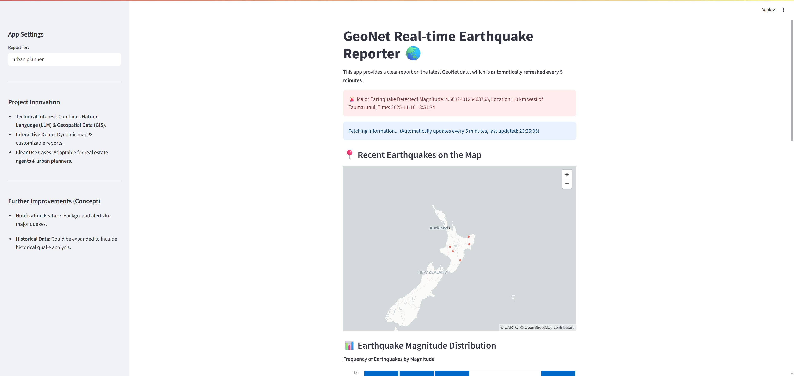

# GeoNet Real-time Earthquake Reporter 🌏

---

**Version**: 1.0  
**Status**: Phase 1 Complete – Ready for Public Sector Review  
**Maintainer**: Taka Murachi

---

## Project Overview

A reproducible GeoAI app for real-time earthquake monitoring, impact reporting, and public-sector communication in New Zealand.  
This Streamlit application retrieves real-time earthquake data from the GeoNet API, visualizes it, and uses a local LLM (e.g., Ollama Llama3) to generate expert-level impact reports.  
It is designed for urban planning, disaster prevention, and educational outreach, reflecting a transparent and audience-aware architecture.

---

## 🔧 Features

### 🌍 Real-time Monitoring
- Updates every 5 minutes using GeoNet API
- Background alert system for M4.0+ events

### 🗺️ Interactive Visualization
- Map of recent earthquakes
- Magnitude distribution chart

### 🤖 LLM-Generated Reports
- Natural language summaries tailored to personas
- Population-aware impact messaging

### 👥 Population Context Integration
- Stats NZ Spatial Query API
- Dynamic messaging based on density

### 🔔 Notification System
- Background scheduler writes alerts to `notification_status.txt`
- Streamlit UI displays alerts in real time

---

## 🖼️ Application Preview

*A brief visual tour of the GeoNet Real-time Earthquake Reporter.*

**Main Dashboard:**
*Shows the main interface with the latest earthquake data and map.*


**LLM-Generated Report:**
*Example of an AI-generated impact summary.*


---


## 🧠 Prompt Design

The LLM prompt is stored in `.llm_prompt.txt`, guiding the model to produce clear, population-aware summaries.  
This design ensures:

- ✅ Reproducibility across environments  
- ✅ Customization for different audiences (e.g., planners, educators)  
- ✅ Trust and transparency for public sector use

**Prompt placeholders:**

- `{{earthquake_data}}` → Injects latest GeoNet data  
- `{{population_data}}` → Injects Stats NZ population context

---

## 🏛️ Public Sector & Educational Use

This app is ideal for:

- **LINZ**: Land use and infrastructure vulnerability
- **SCION / NIWA**: Environmental risk communication
- **Educators**: Teaching geospatial reasoning and disaster preparedness
- **Local Councils**: Public messaging and community awareness

---

## 💡 Key Takeaways & Learnings

This project demonstrates that it is possible to build a powerful GeoAI application with real-time capabilities at **zero cost**. Here are the key takeaways:

- **Cost-Free Architecture**: By leveraging a local LLM (Ollama), free public APIs (GeoNet, Stats NZ), and free-tier services (Streamlit Community Cloud, Gemini CLI), this entire project operates without any cloud billing.
- **Local LLMs for Production**: For many use cases, a fine-tuned local LLM can provide sufficient performance without the cost and latency of cloud-based solutions.
- **Reproducibility is Key**: The use of `requirements.txt`, `.env.example`, and a separate `llm_prompt.txt` file ensures that the project is highly reproducible and transparent, which is critical for public sector and educational applications.
- **Progressive Enhancement**: The project starts with a simple, effective architecture (CSV logging, local LLM) and lays out a clear path for future enhancements (PostGIS, cloud-based services), allowing for a scalable and sustainable development process.

---

## 🧪 Tested On

- Windows 11 / Python 3.11 / Streamlit 1.48  
- Ollama Llama3 (local)  
- Stats NZ API (layer 115044)

---

## 🐳 Running with Docker Compose (Recommended)

This is the easiest way to run the application, as it automatically sets up the application, the Ollama server, and the network between them.

### 1. Prerequisites

- **Docker**: [Install Docker](https://docs.docker.com/get-docker/)
- **Docker Compose**: [Install Docker Compose](https://docs.docker.com/compose/install/)

### 2. Set Up Environment Variables

Create a `.env` file in the root directory of your project and add your Stats NZ API key:

```
STATS_NZ_API_KEY="YOUR_STATS_NZ_API_KEY"
DISCORD_WEBHOOK_URL="YOUR_DISCORD_WEBHOOK_URL"
```

Replace `"YOUR_STATS_NZ_API_KEY"` and `"YOUR_DISCORD_WEBHOOK_URL"` with your actual keys.

### 3. Run the Application

Start the application with a single command:

```bash
docker-compose up --build
```

This will:
- Build the application image.
- Download the Ollama image.
- Start the application, the notification scheduler, and the Ollama server.

Access the Streamlit app in your browser at `http://localhost:8501`.

---

## 🛠️ Manual Setup

If you prefer not to use Docker, you can still run the application locally.

### 1. Clone the Repository

First, clone this repository to your local machine.

```bash
git clone [Your GitHub Repository URL]
cd GeoNetRealtimeEarthquakeReporter
```

### 2. Set Up Virtual Environment

Create a Python virtual environment and install the necessary libraries.

```bash
python -m venv venv
# For Windows
.\venv\Scripts\activate
# For macOS/Linux
source venv/bin/activate
pip install -r requirements.txt
```

### 3. Set Up Environment Variables

Create a `.env` file in the root directory of your project and add your Stats NZ API key:

```
STATS_NZ_API_KEY="YOUR_STATS_NZ_API_KEY"
DISCORD_WEBHOOK_URL="YOUR_DISCORD_WEBHOOK_URL"
```

Replace `"YOUR_STATS_NZ_API_KEY"` and `"YOUR_DISCORD_WEBHOOK_URL"` with your actual keys.

### 4. Run the Application

You will need two separate terminals to run the application.

#### a. Start the Notification Scheduler (Terminal 1)

```bash
python notification_scheduler.py
```

#### b. Start the Streamlit App (Terminal 2)

```bash
streamlit run app.py
```

Access the URL displayed in your browser.

---

## 🤔 Troubleshooting

### ERROR: No matching distribution found for streamlit-autorefresh==0.0.3

If you encounter this error during the `docker-compose up --build` process, it means that the version of `streamlit-autorefresh` specified in `requirements.txt` is not compatible with the Python version in the Docker container.

**Solution:**

1.  Open the `requirements.txt` file.
2.  Find the line `streamlit-autorefresh==0.0.3`.
3.  Change it to a compatible version, for example: `streamlit-autorefresh==1.0.1`.
4.  Run `docker-compose up --build` again.

---

## 🌐 Deployment

To deploy this app on Streamlit Community Cloud, you need to push your code to a GitHub repository.

1.  **Create a GitHub Repository**: Create a new repository on GitHub.
2.  **Link Local to Remote**:
    ```bash
    git remote add origin [Your GitHub Repository URL]
    git branch -M main
    git push -u origin main
    ```
3.  **Deploy from Streamlit Community Cloud**: From the Streamlit Community Cloud dashboard, select your GitHub repository to deploy.

**Note on Cloud Deployment Limitations**:
When deployed to Streamlit Community Cloud, the background notification system and the local Ollama LLM integration will not function as they do on your local machine. These parts would require re-architecting for a cloud deployment (e.g., using cloud-based LLM APIs, or separate cloud services for scheduling).

## ✅ Implemented Improvements (Phase 1 Complete)

- **Notification Feature (Alert System)**:
  - Uses `apscheduler` to monitor the GeoNet API in the background
  - If an earthquake ≥ M4.0 is detected, a message is written to `notification_status.txt`
  - The Streamlit app reads this file and displays alerts in the UI

- **Urban Impact Map - Population Data Integration (Initial)**:
  - Integrated Stats NZ Spatial Query API to fetch population data near epicenters
  - Uses `STATS_NZ_API_KEY` from `.env`
  - Displays raw JSON output in the UI for transparency and debugging

## 🔭 Future Improvement Ideas (Phase 2 onwards)

1. **Enhanced Notification System**  
   Implement real-time alerts via email, SMS, or messaging platforms:
   - Use services like SendGrid, Twilio, or free alternatives such as Discord/Slack webhooks
   - Enable proactive communication for emergency response teams

2. **Historical Earthquake Data Acquisition**  
   Programmatically fetch and analyze historical data for ML training:
   - Use GeoNet’s `/quake?MMI=(int)` endpoint to retrieve events from the past 365 days
   - Build datasets for temporal and spatial modeling

3. **Urban Impact Map – Full ML/DL Integration**  
   Develop predictive models for earthquake vulnerability:
   - **GIS Layers Acquisition**: Building outlines (LINZ), geological maps/fault lines (GNS Science)
   - **Feature Engineering**: Combine seismic history with spatial layers
   - **Model Training**: Train ML/DL models for damage prediction
   - **GIS Visualization**: Display risk scores or heatmaps on the map

4. **Real-time LLM Enhancement**  
   Refine prompt logic to generate deeper insights:
   - Identify most affected cities
   - Recommend countermeasures or preparedness actions
   - Tailor messaging based on severity and population context

5. **User-Specific Reports (Prompt Tuning)**  
   Customize LLM output based on user roles:
   - Urban planners → infrastructure impact
   - Real estate agents → land use and valuation
   - Disaster management personnel → emergency response and public messaging

## 🛠️ DevOps & LLMOps Alignment

This project reflects key principles of DevOps and LLMOps:

- **Infrastructure as Code**: Environment setup is fully scripted via virtualenv, `.env.example`, and modular components.
- **CI/CD Readiness**: The architecture separates notification logic and UI, enabling scalable deployment and testing.
- **LLMOps Control**: Prompt logic is externalized in `.llm_prompt.txt`, allowing reproducible and auditable LLM behavior across environments.

---

## 🚀 Long-Term Vision: Advanced MPC & Sandboxing for Secure GeoAI

This phase introduces a **Model-centric Programming (MPC)** architecture, executed within a **secure sandbox**, to create a truly reproducible, auditable, and safe GeoAI pipeline for public and educational settings.

```
flowchart TD

%% =========================
%%  GEOAI ARCHITECTURE
%% =========================

subgraph U["👤 User / Client"]
  U1[User interacts via web browser]
end

subgraph S["🧭 Streamlit App (UI Layer)"]
  S1[Displays dashboards & results]
  S2[Sends queries to backend securely]
end

subgraph M["⚙️ MPC Server (Docker Container)"]
  
  subgraph SB["🧱 Sandboxed Environment"]
    
    subgraph L["🤖 LLM Agent"]
      L1[GeoAI Reasoning Engine]
    end
    
    subgraph T["🧰 Allowed Tool Set"]
      T1[fetch_geonet_data()]
      T2[query_stats_nz()]
      T3[geojson_to_map()]
    end
    
    subgraph P["📜 Data Access Policies"]
      P1[Restrict external access]
      P2[Allow only approved APIs]
    end

    L --> T
    T --> P

    subgraph A["🌍 External Data APIs"]
      A1[GeoNet API (Earthquake Data)]
      A2[Stats NZ API (Demographics, Geography)]
    end

    P --> A

  end
end

%% FLOW CONNECTIONS
U --> S --> M
M --> SB
SB --> L

%% VISUAL FLOW
A1 -.-> L
A2 -.-> L

🧩 Description

Top-down data flow: User → Streamlit → MPC Server → Sandboxed LLM → External API.

Emphasis on the sandbox: Internally, "LLM," "Allowed Tools," and "Access Policies" are clearly separated.

Only secure paths are connected: Access is controlled in the following order: LLM → Tools → Policies → APIs.


```

### 🧠 MPC-Enabled LLM Integration
Instead of just passing data to a prompt, the LLM operates as an **agent** within a controlled environment. The MPC server defines the **exact context** for the LLM:
- **Permitted Tools**: The LLM can only use a pre-approved set of tools (e.g., `fetch_geonet_data`, `query_stats_nz`).
- **Data Access Policies**: The LLM's access to data is strictly governed by the MPC server, preventing unauthorized data access.
- **Environment Constraints**: The LLM operates within a sandboxed environment, isolating it from the host system and network.

### 🧭 Dockerized MPC Server for Public Institutions
The entire MPC server and the sandboxed environment are packaged into a **Docker container**. This allows public institutions (LINZ, SCION, NIWA) to:
- **Deploy with Confidence**: Run the GeoAI pipeline in a secure, isolated environment without risking their internal systems.
- **Ensure Reproducibility**: Guarantee that the AI's behavior is consistent and auditable across different deployments.
- **Customize with Control**: Safely integrate their own internal GIS layers and data into the MPC context.

### 🧑‍🏫 Educational MPC Server for GeoAI Learning
A simplified version of the MPC server can be used in schools and universities to:
- **Teach AI Safety**: Demonstrate the principles of sandboxing and controlled AI execution.
- **Promote Hands-on Learning**: Allow students to safely experiment with LLM agents for geospatial analysis.
- **Foster Trust in AI**: Build a deeper understanding of how to create trustworthy and reliable AI systems.

### 🧩 Why This Architecture Matters
This vision goes beyond a simple app. It's a blueprint for a **secure, reproducible, and auditable GeoAI pipeline**. By combining the explicit context of MPC with the security of sandboxing, we can build AI systems that are not only powerful but also trustworthy, making them suitable for critical applications in the public sector and education.

---

## 🤖 How an AI Agent Interacts with This Project

This project is designed to be "AI-Ready," meaning that it can be easily understood and interacted with by AI agents (like the one you might be interacting with right now). Here's a conceptual overview of how an AI agent might approach this project:

1.  **Fetching the README**: The agent starts by fetching the `README.md` from the GitHub repository to get a comprehensive overview of the project.

2.  **Extracting Key Information**: The agent parses the `README.md` to identify key sections:
    - **Features**: To understand the project's capabilities.
    - **Running with Docker Compose**: To learn how to set up and run the project.
    - **Key Takeaways & Learnings**: To grasp the project's core principles, such as its cost-free architecture.
    - **Long-Term Vision**: To understand the project's future goals and advanced architecture.

3.  **Understanding the Architecture**: The agent analyzes the architecture diagrams and descriptions to build a mental model of how the components (Streamlit app, MPC server, Ollama, external APIs) interact.

4.  **Generating Code and Answering Questions**: Based on this deep understanding, the agent can:
    - **Answer questions** about the project's features, setup, and architecture.
    - **Generate code** to extend the project's functionality.
    - **Suggest improvements** or modifications based on the project's long-term vision.
    - **Troubleshoot issues** by reasoning about the potential points of failure in the architecture.

By providing a well-structured and detailed `README.md`, we make it easier for both humans and AI agents to understand, use, and contribute to the project.

---

## 9. 🧩 Why This Architecture Matters

This project is more than a tool—it is a reproducible, auditable GeoAI pipeline designed for public institutions and classrooms.  
By separating prompt logic, environment variables, and data sources, it ensures trust, transparency, and adaptability across audiences.  
It reflects a Model Context Protocol (MCP)-like design philosophy, enabling safe deployment and educational clarity in geospatial reasoning.

## 🗂️ Data Logging Strategy (CSV → PostGIS Transition)

To ensure reproducibility and public-sector auditability, this project begins with a lightweight CSV-based logging system and transitions to a robust PostGIS database in later phases.

### ✅ Phase 1: CSV Logging
- Earthquake data is appended to `data/earthquake_log.csv` on each refresh.
- This file serves as a transparent, portable record for validation, sharing, and ML preprocessing.
- Monthly rotation (e.g., `earthquake_log_202511.csv`) is recommended for long-term storage and analysis.

### 🚀 Phase 2: PostGIS Integration
- A dedicated ETL script will ingest CSV logs into a PostGIS database.
- Enables spatial queries (`ST_Within`, `ST_Distance`, `ST_Intersects`) for population impact, fault proximity, and urban vulnerability.
- Supports ML/DL model training with structured spatial features.

### 🧱 Phase 3: MCP-Ready Data Layer
- PostGIS becomes the core data layer for the MCP server.
- LLMs query structured earthquake and population data via controlled interfaces.
- Ensures reproducibility, transparency, and safe deployment in public institutions.

**Why this matters**  
This staged strategy balances accessibility (CSV) with analytical power (PostGIS), ensuring that the system remains transparent, scalable, and adaptable across public, educational, and technical domains.

